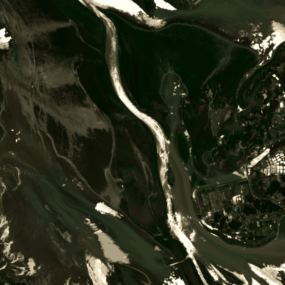
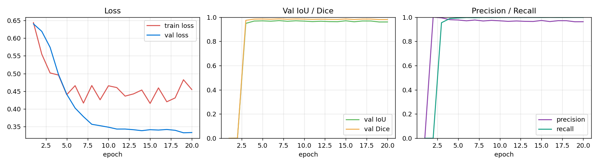
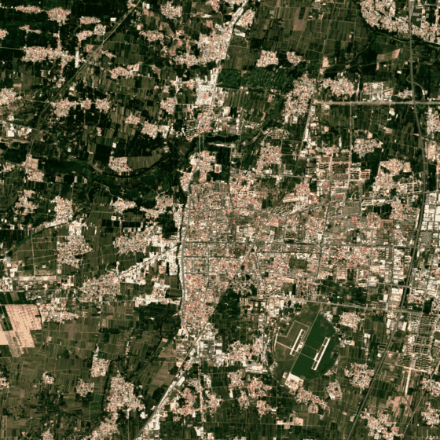

<div align="center">

# 🛰️ 慧眼识灾

**基于深度学习的高分辨率遥感影像洪水淹没范围智能识别系统**

把灾后人工目视解译的 **1–3 天**，压缩到 **分钟级** 自动完成

为应急管理提供「看得见的决策依据」



<sub>▲ **真实 Sentinel-2 L2A 影像**：2020 年鄱阳湖特大洪水（灾前 2020-05-19 → 灾后 2020-07-15，窗口云量 4.3% / 0.1%）<br>
识别结果：水体 44.02 km² → 154.37 km²，新增淹没 110.72 km²（NDWI 基线，单景 < 1 秒）</sub>

[快速开始](#-30-秒跑起来) · [效果](#-效果与指标) · [架构](#-系统架构) · [路演材料](#-路演与答辩材料)

</div>

---

## 😣 痛点

灾害发生后，**"哪里被淹了、淹了多少"** 这个最基本的问题，今天仍然主要靠人盯着卫星图一笔笔圈。

| 现状 | 后果 |
|---|---|
| 卫星过境 → 人工目视解译 → 逐级上报，**1–3 天** | 错过黄金 72 小时救援期 |
| 不同人圈出来的范围不一样 | 面积口径不一，保险定损争议大 |
| 商业遥感软件贵、操作门槛高 | 基层单位用不起、不会用 |

**核心矛盾：不是没有数据，是没有把数据变成结论的能力。**

## 💡 方案

输入一景免费公开的卫星影像，输出**像元级洪水范围 + 平方公里级面积 + 一页可上报的 PDF 简报**。

```
[输入]  光学：Sentinel-2 / 高分系列    雷达：Sentinel-1 IW GRD（穿云）
   │
[预处理] 光学：波段还原 → NDWI 水体指数 → 512×512 切片 → 归一化
   │     雷达：标定查找表 → σ0(dB) → GCP 仿射定位 → 两景对齐到同一 UTM 网格
   │
[识别]   三种策略
   ├─ 光学基线：NDWI + Otsu 自适应阈值 + 近红外物理闸门   ← 零训练、零 GPU
   ├─ 光学深度：U-Net 语义分割（smp + ImageNet 预训练骨干） ← 精度上限
   └─ 雷达：低后向散射 + 相对变暗双条件提取水体            ← 汛期穿云，2021 河南实测可用
   │
[后处理] 形态学去噪 → 连通域过滤 → 空洞填充 → 轮廓叠加 → 面积统计(km²)
   │
[展示]   Gradio Web 界面 / 桌面应用（4 个页签 + 批量任务面板）
   ├─ ① 单时相识别（光学）
   ├─ ② 灾前 ↔ 灾后 对比（光学）
   ├─ ③ 雷达 SAR 识别（Sentinel-1 SAFE 直接处理，自动定位洪水）
   ├─ ④ 关于系统
   └─ ⑤ 批量任务（CSV/JSON 导入 → 队列 → 成果包下载，v0.4.0 新增）
```

---

## 🆕 v0.4.0：从「点一次出一个结果」到「可复现的批量处理」

| 能力 | 说明 |
|---|---|
| **请求契约与缓存身份** | 一次处理请求（坐标、灾前灾后四个日期、窗口、地形档案、云量/最小有效比例）冻结为 `PipelineRequest`，全字段 + schema 版本取 SHA256 作为缓存键；任一字段变化就换键，不会误用别人的结果 |
| **可恢复流水线** | acquire / detect / export 分阶段原子写 manifest（完整请求、输入哈希、工件与成果哈希）；同一 `run_id` 重跑先校验身份与成果，一致直接复用，身份不符拒绝覆盖 |
| **共同有效区统计** | 单景 `valid_mask`（波段有限 + 非 NoData + 剔除云 + SCL 0/1/11）；变化只在灾前/灾后**共同有效区**内计算——"灾前有云、灾后有水"不再被算成新增淹没；数据不足时明确回报，而不是输出"零淹没" |
| **地形地貌档案** | 平原 / 丘陵 / 山地 / 城市 / 海岸 作为**用户声明的判读语境**（绝不据此修改水体阈值）；可选本地 DEM，输出坡度风险栅格供人工复核，NoData 不当零坡度 |
| **GIS 成果** | 成果包内含 `water_mask.tif` / `valid_mask.tif` / `change.tif` / `terrain_risk.tif`，与源影像同 CRS、transform，可直接导入 GIS |
| **批量任务** | SQLite 任务库 + 串行 worker；CSV/JSON 逐行校验导入（坏行只报错、不影响好行）、失败重试、显式恢复、取消排队；命令行 `scripts/run_batch.py --list/--run/--retry/--cancel/--recover` |

详见 [CHANGELOG.md](CHANGELOG.md) 与 [docs/遥感自动化改进路线图_20260923.md](docs/遥感自动化改进路线图_20260923.md)。

## 🚀 30 秒跑起来

```powershell
# 1. 装依赖（国内可加 -i https://pypi.tuna.tsinghua.edu.cn/simple）
pip install -r requirements.txt

# 2. 生成演示样本（合成 Sentinel-2 风格影像 + 真值，约 30 秒）
python data/make_samples.py --n 6 --size 640

# 3.（推荐）抓取真实 Sentinel-2 灾前/灾后影像，约 3 分钟
python scripts/fetch_real_samples.py --event all

# 4. 启动界面
python app/main.py            # 浏览器打开 http://127.0.0.1:7860
```

> **没有 GPU、没有训练数据、没有任何权重也能完整演示** —— 系统会自动使用 NDWI 基线。
> 仓库已预置 `data/real/` 两组真实影像（鄱阳湖 2020、涿州 2023），第 3 步可跳过。

**一行代码跑识别（真实影像）：**

```python
from src import FloodDetector

result = FloodDetector(mode="baseline").detect("data/real/poyang2020_post.tif")
print(result.summary_text())
# 【识别结论】NDWI + Otsu 基线 检测到水体面积 154.37 km²，占影像面积 94.20%，共 4 个连通水域。
# 【处理耗时】1.06 秒（像元 10 m）
```

**训练自己的模型：**

```powershell
# 先用内置合成样本验证训练链路（CPU 约 1 分钟）
python train.py --data data/samples --epochs 20 --img-size 256 --arch tiny

# 真实数据（推荐）
python scripts/download_data.py --dataset sen1floods11          # 看下载指引
python train.py --data data/sen1floods11 --epochs 60 --img-size 512 `
    --arch smp --encoder resnet34 --encoder-weights imagenet --batch-size 8
```

---

## 🖥️ 桌面应用（安装即用 / 双击即用，无需装 Python）

### 方式一：标准安装包（推荐发给别的电脑）

| 安装包 | 体积 | 内容 |
|---|---|---|
| `慧眼识灾_安装程序_v0.2.0_精简版.exe` | **174.6 MB** | NDWI + Otsu 基线，启动快 |
| `慧眼识灾_安装程序_v0.2.0_完整版.exe` | **351.9 MB** | 额外含 PyTorch + U-Net |

别人拿到后：**双击 setup.exe → 下一步 → 完成 → 开始菜单/桌面点「慧眼识灾」直接用**。
无需管理员权限、无需装 Python、无需联网；卸载走「添加或删除程序」。

安装包会创建：开始菜单（`慧眼识灾` / `使用说明` / `识别结果目录`）、桌面快捷方式、卸载项，
安装目录可写，识别结果与 PDF 简报就存在 `<安装目录>\outputs\`。

```powershell
# 一条命令生成安装包（会自动下载 Inno Setup 编译器）
powershell -ExecutionPolicy Bypass -File build/build_installer.ps1
```

### 方式二：绿色版 zip（解压即用）

| 版本 | 解压后 | 分发包(zip) | 适用 |
|---|---|---|---|
| 精简版 | 427 MB | **229 MB** | 现场演示、U 盘分发 |
| 完整版 | 878 MB | **401 MB** | 算法评测、需要深度模型 |

```powershell
powershell -ExecutionPolicy Bypass -File build/build_app.ps1 -Profile lite   # 产物 dist/
powershell -ExecutionPolicy Bypass -File build/build_app.ps1 -Profile full   # 产物 dist_full/
python scripts/verify_packaged_app.py --exe "dist/慧眼识灾/慧眼识灾.exe"    # 自动验收
```

> 打包踩过的坑（GDAL/PROJ 数据、delvewheel DLL、uvicorn 日志、polars 176 MB 体积、中文 PDF 字体）
> 与完整验证记录见 [`docs/desktop_app.md`](docs/desktop_app.md)。
>
> ⚠️ 未签名的安装包首次运行会有 SmartScreen「未知发布者」提示，点「更多信息 → 仍要运行」即可；
> 正式对外分发建议做代码签名。

---

## 📊 效果与指标

### 合成验证集（6 景，10 m 分辨率，逐像元真值）

| 方法 | IoU | Precision | Recall | 说明 |
|---|---|---|---|---|
| NDWI 全局 Otsu | 0.826 | 0.872 | 0.944 | 城市屋顶造成大量假阳性 |
| **+ 近红外物理闸门（本方案基线）** | **0.920** | **0.979** | 0.938 | 一行先验，IoU +0.09 |
| U-Net（TinyUNet，20 epoch / 46 秒 / CPU） | 0.971 | 0.964 | 0.998 | 留出场景验证 |

**关键发现**：纯 NDWI 最大的假阳性来源是**城市建成区**——屋顶在绿-近红外指数上与浅水相似（NDWI ≈ −0.09，高于 Otsu 阈值）。
水体近红外反射率极低（< 0.05）而城市很高（> 0.15），加一道「近红外闸门」后：

```
IoU        0.826 → 0.920    (+11.4%)
Precision  0.872 → 0.979    (+12.3%)
```

> ### ⚠️ 诚实声明
> 上表是**合成演示数据**上的结果，只能证明「代码没写错、流程跑得通」。
> **不能代表真实洪灾上的精度。** 真实精度必须用 Sen1Floods11 等公开数据集训练后重新评测，
> 这也是下一阶段的核心目标。仓库内所有对外数字都会标注数据来源。

### 训练曲线

`python train.py` 自动记录 `logs/train_log.csv` 并绘制 `logs/train_curve.png`（Loss / IoU / P-R 三联图）。

仓库内已附一份合成数据训练记录（20 epoch / 46 秒 / CPU）：



<sub>▲ 留出场景验证：最佳 IoU 0.971 @ epoch 7 ｜ 原始日志：`docs/assets/train_log.csv`</sub>

---

## 🛰️ 真实卫星影像（不是合成数据）
仓库里已经放好**两组真实 Sentinel-2 L2A 灾前/灾后影像**，数据来源可逐条溯源：

| 样本 | 事件 | 灾前景（日期） | 灾后景（日期） | AOI 窗口云量 |
|---|---|---|---|---|
| `poyang2020` | 2020·江西鄱阳湖特大洪水 | `S2A_50RMT_20200519_1_L2A`（05-19） | `S2A_50RMT_20200715_0_L2A`（07-15） | 4.3% / 0.1% |
| `zhuozhou2023` | 2023·河北涿州暴雨洪涝 | `S2A_50SMJ_20230716_0_L2A`（07-16） | `S2A_50SMJ_20230815_0_L2A`（08-15） | 0.0% / 0.0% |

- 来源：**AWS 公开桶 `sentinel-cogs`**（免注册、免密钥），经 **Element84 Earth Search STAC** 检索
- 许可：Copernicus Sentinel Data Terms（免费开放）
- 窗口：12.8 km × 12.8 km（1280×1280 像元，10 m）= 163.84 km²
- 抓取脚本：`python scripts/fetch_real_samples.py --event all`
- 完整溯源见 [`data/real/README.md`](data/real/README.md) 与 `data/real/samples.json`

### 真实影像上的识别结果（NDWI + Otsu 基线 + 近红外闸门）

| 样本 | 灾前水体 | 灾后水体 | 新增淹没 |
|---|---|---|---|
| 鄱阳湖 2020 | 44.02 km² | 154.37 km² | **110.72 km²** |
| 涿州 2023 | 1.33 km² | 5.26 km² | **3.98 km²** |



<sub>▲ 涿州 2023（真实影像）：灾前 1.33 km² → 灾后 5.26 km²，新增淹没 3.98 km²</sub>

> **这仍然不是精度评估** —— 真实影像没有逐像元人工标注，只能做"量级合理性"的定性交叉验证
> （与公开灾情报道对比）。定量指标必须等 Sen1Floods11 训练评测。

### 抓真实数据时踩到的三个坑（都已解决，也是很好的答辩素材）

**1. BOA 偏移量：错一步，NDWI 直接失效。**
2022-01-25 后 ESA 的 L2A 产品带 −1000 偏移，而 Earth Search 的 COG 有的已扣、有的没扣，
STAC 里的 `earthsearch:boa_offset_applied` 标记**存在已知错误**
（[issue #66](https://github.com/Element84/earth-search/issues/66)、[#71](https://github.com/Element84/earth-search/issues/71)）。
我们的做法是**与原始 JP2 逐窗比对**：同一窗口若 `中位DN(COG) − 中位DN(JP2) ≈ −1000`，
则判定 COG 已扣偏移。实测某景 COG 中位 DN=589、JP2=1589，差值恰好 −1000 —— 若按官方 README
再减 0.1，整景反射率会被压成负值。

**2. UTM 瓦片是旋转的。** 瓦片包围盒的角上是大片 nodata，AOI 落在角上会读出一片 0。
脚本用 SCL 缩略图定位最近的有效像元并平移窗口（偏移量记录在溯源字段里）。

**3. 汛期云雨同步：2024 洞庭湖团洲垸决口，光学卫星看不见。**
脚本尝试抓取 2024-07-06 ~ 07-25 的影像，**AOI 窗口云量最低的一景仍有 33.5% 被云遮挡**
（最差 99.9%），超过阈值被拒绝出图。这不是脚本的问题，是光学遥感的固有短板 ——
**洪水来了，云也来了**。这正是 Roadmap 里 Sentinel-1 雷达融合排在第一位的直接原因。

### 一个必须说清的域差异

用**合成样本**训练的 U-Net 直接跑真实影像，在鄱阳湖这种大水体上还行（155 km² vs 基线 154 km²），
但在涿州这种小尺度城区洪水上明显过检（12.17 km² vs 基线 5.26 km²）。
系统会在结果里自动给出提示，避免误读：

> ⚠️ 该权重是在合成样本上训练的，仅用于验证流程；真实影像上的分割结果可能过检/漏检，
> 请以 NDWI 基线结果交叉验证，或用 Sen1Floods11 重新训练

**结论：真实精度必须用真实数据训练。** 这也把 M2 的下一步指向得非常明确。

---

## 📡 雷达（SAR）识别：汛期穿云，实测河南 7·20

光学卫星最大的短板是**云**——2024 洞庭湖团洲垸决口时，AOI 窗口云量最低的一景仍有 33.5% 被遮挡。
Sentinel-1 雷达能穿云，是洪水监测的刚需。系统已内置完整雷达处理链：

```
SAFE 产品 → 解析标定表 → σ0(dB) → GCP 仿射定位 → 两景投影到同一 UTM 网格
          → 自动定位洪水 → 裁剪 → 低回波 + 相对变暗双条件提取 → 面积统计
```

**实测（2021 河南"7·20"暴雨，你下载的那对数据）**：

| 项目 | 结果 |
|---|---|
| 灾前景 | `S1A_IW_GRDH_1SDV_20210715T102036...`（2021-07-15，VV） |
| 灾后景 | `S1A_IW_GRDH_1SDV_20210727T102036...`（2021-07-27，VV） |
| 灾前水体 | **1.61 km²** |
| 灾后水体 | **18.98 km²** |
| 新增淹没 | **17.01 km²**（尉氏/贾鲁河分洪区，114.16°E, 34.48°N） |

**怎么用**：

```powershell
# 先体检：不管下载了什么，先跑这个，它会告诉你该用哪条命令
python scripts/check_data.py "F:\遥感河南"

# 雷达双时相处理（自动定位洪水）
python scripts/prepare_s1_sar.py --pre "...\S1A_..._20210715...\*.SAFE" `
    --post "...\S1A_..._20210727...\*.SAFE" --pol VV --out data/henan2021

# 或者直接用软件：页签 ③ 雷达 SAR 识别 → 粘贴两个 SAFE 路径 → 点按钮
```

完整说明见 **[`docs/数据使用指南.md`](docs/数据使用指南.md)**（含决策树、下载渠道、参数调优、常见问题）。

> **雷达 vs 光学**：光学看"颜色"（NDWI），雷达看"回波强度"（σ0，dB）。
> 水体在光学里是亮的，在雷达里是暗的（平静水面像镜子）。**两套数据不能混着用**，
> 所以系统做了两套识别链，而不是把雷达图当光学图硬套。

---

## 🧠 系统架构

| 模块 | 文件 | 职责 |
|---|---|---|
| 预处理 | `src/preprocess.py` | 读写 GeoTIFF/PNG/NPY、波段解析、反射率还原、NDWI、百分位拉伸、切片拼接 |
| 基线模型 | `src/baseline.py` | 全局/局部 Otsu、近红外闸门、退化场景保护、软概率输出 |
| 深度模型 | `src/model_unet.py` | U-Net（smp 可选）+ 纯 PyTorch 兜底 TinyUNet、Dice+BCE 损失、分块推理、IoU 指标 |
| 后处理 | `src/postprocess.py` | 形态学、连通域、空洞填充、轮廓、面积换算、双时相变化统计、变化图 |
| 统一推理 | `src/infer.py` | `FloodDetector` / `FloodResult`，模型自动选择与降级 |
| 雷达处理 | `src/sar.py` | Sentinel-1 标定（σ0 dB）、GCP 仿射定位、两景对齐、水体提取、变化检测 |
| 数据体检 | `scripts/check_data.py` | 不管下载了什么，先跑它就知道该用哪条命令 |
| 雷达入口 | `scripts/prepare_s1_sar.py` | 命令行处理 SAFE 对，与界面共用同一套核心函数 |
| 成果导出 | `src/report.py` | 掩膜/热力图/叠加图 PNG、统计 JSON、中文 PDF 简报、zip 打包 |
| 训练 | `train.py` | 场景级划分、数据增广、AMP、余弦退火、最优权重保存、曲线记录 |
| 界面 | `app/main.py`、`app/components.py` | 三个页签、对比滑块、统计卡片、导出、示例样本 |
| 桌面应用 | `app/desktop.py`、`build/` | 双击 exe 启动、自动选端口、应用窗口、控制窗、一键打包 |

### 三个值得说的工程细节

1. **训练-推理一致性**：归一化均值/标准差随权重一起保存，推理端直接复用，杜绝「训练用一套、推理用另一套」的隐性 bug。
2. **分块滑窗 + 重叠加权**：512 切片带 64 像元重叠，拼接时取平均，大图不会出现块状硬缝（有单元测试保证「拼接能无损还原」）。
3. **演示不中断**：权重缺失/损坏、影像缺近红外波段、整景无有效信号（全水/全陆/云覆盖）等异常路径全部有兜底，自动降级并给出中文提示。

---

## 📁 仓库结构

```
flood-eyes/
├── app/
│   ├── main.py              # Gradio 入口：三个页签 + 回调
│   └── components.py        # 统计卡片、对比滑块、导出、示例清单
├── src/
│   ├── preprocess.py        # 波段计算、NDWI、切片、归一化
│   ├── baseline.py          # NDWI + Otsu 基线（含近红外闸门）
│   ├── model_unet.py        # U-Net（smp）+ TinyUNet 兜底
│   ├── sar.py               # 雷达：σ0 标定、GCP 定位、对齐、水体提取、变化检测
│   ├── infer.py             # 统一推理接口 / 双时相对比
│   ├── postprocess.py       # 去噪、连通域、面积统计、变化图
│   └── report.py            # PNG / JSON / PDF 简报 / zip 导出
├── data/
│   ├── make_samples.py      # 合成演示样本生成器（含物理先验）
│   ├── samples/             # 6 景合成样本 + 逐像元真值 + 清单
│   └── real/                # 2 组真实 Sentinel-2 灾前/灾后影像 + 溯源清单
├── scripts/
│   ├── check_data.py         # 数据体检：不管下载了什么，先跑它
│   ├── prepare_s1_sar.py     # 雷达 SAFE → 水体范围 + 面积（命令行）
│   ├── fetch_real_samples.py # 抓真实 Sentinel-2（STAC + COG 窗口读 + 偏移量比对）
│   ├── download_data.py      # Sen1Floods11 等训练数据获取指引
│   ├── make_demo_gif.py      # 生成 README 演示动图（支持真实/合成样本）
│   ├── make_icon.py          # 生成应用图标
│   ├── verify_packaged_app.py # 打包产物自动验收
│   ├── check_env.py          # 环境自检
│   └── quickstart.ps1        # 一键快速开始
├── build/
│   ├── flood_eyes.spec      # PyInstaller 打包配置（lite / full 两档）
│   ├── build_app.ps1        # 一键打包 exe
│   ├── build_installer.ps1  # 一键生成标准安装包（自动装 Inno Setup）
│   ├── installer.iss        # Inno Setup 安装脚本
│   ├── rthook_paths.py      # 运行时钩子（GDAL/PROJ 数据路径）
│   └── version_info.txt     # Windows 版本信息
├── tests/test_pipeline.py   # 35 项全流程自检（含雷达合成数据回归）
├── docs/
│   ├── demo_script.md       # 3 分钟路演脚本 + 评委问答
│   ├── pitch_outline.md     # 答辩 PPT 大纲（17 页）
│   ├── 数据使用指南.md       # ⭐ 下载的数据怎么用在本系统上（决策树 + 命令）
│   ├── desktop_app.md       # 桌面应用 / 安装包构建与分发
│   ├── competition_checklist.md  # M0–M4 执行清单
│   └── assets/              # 演示 GIF、训练曲线、应用图标
├── train.py                 # U-Net 训练脚本
├── weights/                 # 训练权重（.gitignore 排除）
├── requirements.txt
└── README.md
```

---

## ✅ 自检

```powershell
python tests/test_pipeline.py
# Ran 35 tests ... OK
```

覆盖：波段解析 / NDWI / Otsu 退化保护 / 近红外闸门 / 面积换算 / 形态学 / 双时相 /
模型前向 / 损失单调性 / 分块推理与整图一致性 / 权重存取 / 导出 PDF / 端到端 IoU。

---

## 🗺️ Roadmap

| 阶段 | 内容 | 状态 |
|---|---|---|
| M0 | 环境 + 依赖 + 自检 | ✅ |
| M1 | 基线 + 后处理 + Gradio v0.1 | ✅ |
| M2 | U-Net 训练链路 + 指标曲线 | ✅（合成数据）；⬜ Sen1Floods11 真实训练 |
| M3 | 双时相 + 面积报表 + PDF 导出 + 美化 | ✅ |
| M4 | 仓库 + README + GIF + 路演材料 | ✅；⬜ 3 分钟录屏 |
| 真实数据 | 抓取真实 Sentinel-2 灾前/灾后影像（2 组，含溯源） | ✅ |
| 下一步 | Sentinel-1 雷达融合（解决云遮挡）、Sen1Floods11 真实训练、乡镇级报表 | ⬜ |

---

## ⚖️ 数据与许可

- **合成演示样本**（`data/samples/`）：本仓库程序合成，可自由使用，但**不可用于宣称精度**。
- **真实影像**（`data/real/`）：Sentinel-2 L2A，源自 ESA/Copernicus，经 AWS 公开桶
  `sentinel-cogs` 与 Element84 Earth Search STAC 获取，适用
  [Copernicus Sentinel Data Terms](https://sentinels.copernicus.eu/documents/247904/690755/Sentinel_Data_Legal_Notice)（免费、可商用、需注明来源）。
  完整溯源见 `data/real/samples.json`。
- **训练数据**：Sen1Floods11（学术公开数据集）、Sentinel-2（ESA 免费公开数据）。
- **代码**：建议以 MIT / Apache-2.0 开源（提交前请补充 `LICENSE` 文件）。

## 📚 路演与答辩材料

| 材料 | 文件 |
|---|---|
| 3 分钟路演脚本（含评委问答） | [`docs/demo_script.md`](docs/demo_script.md) |
| 答辩 PPT 大纲（17 页） | [`docs/pitch_outline.md`](docs/pitch_outline.md) |
| M0–M4 执行清单 + 风险预案 | [`docs/competition_checklist.md`](docs/competition_checklist.md) |
| 演示动图 | [`docs/assets/demo_real_poyang.gif`](docs/assets/demo_real_poyang.gif) |

---

<div align="center">
<sub>慧眼识灾 · 演示版 v0.1 ｜ 让每一景免费卫星影像，都能在救援决策中被用上</sub>
</div>
